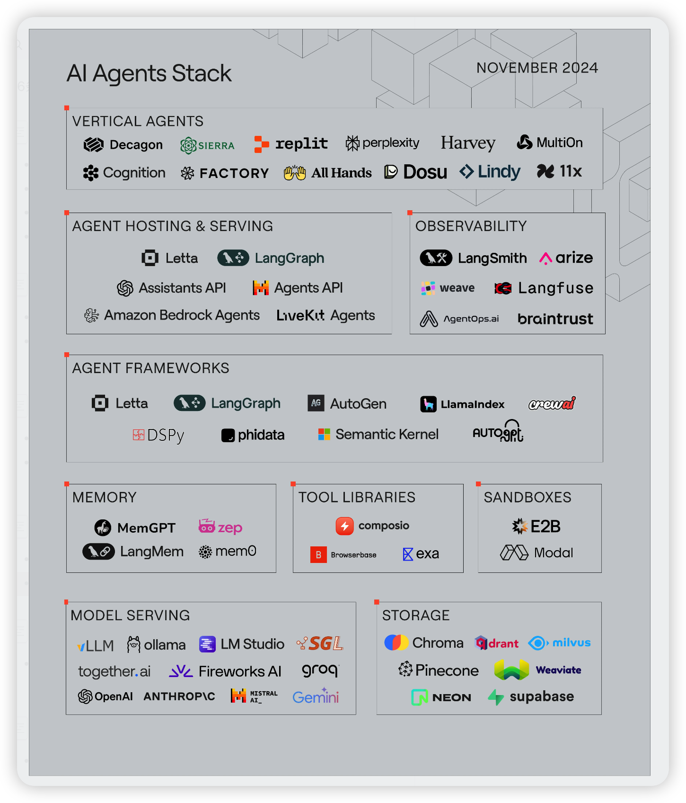

# agent atals

A browsable atlas for AI agent stack selection, ecosystem scanning, and scenario-based recommendations.

## Online

GitHub Pages:

[https://zirenli-001.github.io/agent_atals/](https://zirenli-001.github.io/agent_atals/)

Repository:

[https://github.com/ZIRENLI-001/agent_atals](https://github.com/ZIRENLI-001/agent_atals)

## Preview

## What It Covers

- scenario playbooks for common business domains
- frontend, backend, database, serving, infra, and agent framework choices
- ecosystem map across vertical agents, hosting, observability, memory, tools, and storage
- common production issues and countermeasures by system layer
